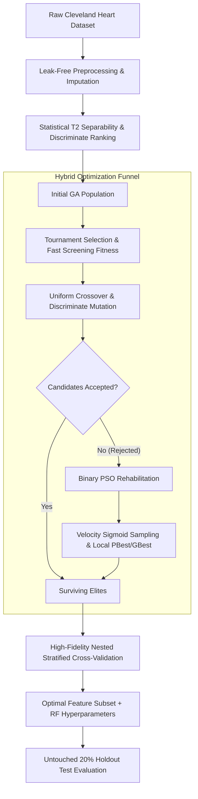

# 🫀 HeartGAPSO Documentation Suite

Welcome to the comprehensive technical documentation for **HeartGAPSO** — a hybrid Genetic Algorithm & Particle Swarm Optimization (GA-PSO) pipeline for joint feature selection and Random Forest hyperparameter tuning on the UCI Heart Disease dataset.

---

## 📚 Documentation Index

| Document | Description | Key Topics |
|---|---|---|
| [**Algorithm Deep Dive (`ALGORITHM.md`)**](file:///d:/code/HeartGAPSO/docs/ALGORITHM.md) | In-depth mathematical formulation and step-by-step logic | Chromosome encoding, $T^2$ statistical separability score, Discriminate mutation, Sigmoid velocity PSO repair, Multi-objective fitness function |
| [**Configuration Reference (`CONFIGURATION.md`)**](file:///d:/code/HeartGAPSO/docs/CONFIGURATION.md) | Complete reference for all hyperparameters, flags, and dataclasses | `FitnessConfig`, `GAConfig`, CLI arguments for `train.py`, search spaces, recommended tuning presets |
| [**API & Module Reference (`API_REFERENCE.md`)**](file:///d:/code/HeartGAPSO/docs/API_REFERENCE.md) | Full architectural reference of all `src/` modules and public classes/functions | `gapso_optimizer`, `fitness`, `genetic_algorithm`, `particle_swarm`, `data_loader`, `cross_validation`, `metrics_calculator` |
| [**Pipeline Execution & Benchmark (`PIPELINE_RUN.md`)**](file:///d:/code/HeartGAPSO/docs/PIPELINE_RUN.md) | Full log, execution results, benchmark comparison, and holdout evaluation | Benchmark table vs 36 baselines, candidate audit table, confusion matrix, patient inference case studies |
| [**Methodology Overview (`METHODOLOGY.md`)**](file:///d:/code/HeartGAPSO/docs/METHODOLOGY.md) | High-level overview of theoretical workflow vs current implementation | Reference paper architecture, leak-free CV guarantees, threshold calibration |

---

## 🚀 Quick Start

### 1. Requirements & Setup
Ensure dependencies are installed:
```powershell
pip install -r requirements.txt
```

### 2. Run Full Modular Training
```powershell
python train.py --data-path data/processed/cleveland.csv --generations 20 --population-size 30 --pso-particles 15 --cv-folds 5
```

### 3. Run Monolithic Interactive Pipeline (v4)
```powershell
python "heartgapso_pipeline_v4 (3).py"
```

---

## 🔬 Core System Architecture at a Glance


